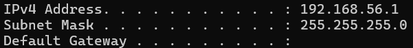

# Subnetting Basics

## What is Subnetting?

Subnetting is the process of dividing a large network into smaller, manageable networks.

Purpose:
- Improve performance
- Enhance security
- Reduce broadcast traffic
- Enable network segmentation

---

## Subnet Mask

A subnet mask determines how many bits belong to the network portion.

Example:
/24 = 255.255.255.0

Binary:
11111111.11111111.11111111.00000000

---

## Example Subnet

Network:
192.168.1.0/24

Network address:
192.168.1.0

First usable host:
192.168.1.1

Last usable host:
192.168.1.254

Broadcast address:
192.168.1.255

---

## Formula for Hosts

2^n - 2

Where n = number of host bits.

Example:
/24

8 host bits

2^8 - 2 = 254 usable hosts

---

## Why Subnetting Matters for Security

- Network segmentation reduces lateral movement
- VLAN separation improves isolation
- SOC analysts must understand internal IP ranges
- Firewall rules depend on subnet definitions
