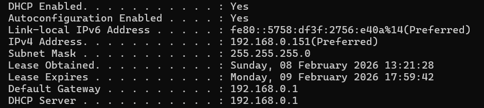

# Dynamic Host Configuration Protocol (DHCP)

## What is DHCP?

DHCP automatically assigns IP addresses to devices on a network.

Without DHCP, IP addresses would need to be assigned manually.

---

## DHCP Process (DORA)

Discover  
Offer  
Request  
Acknowledge  

This 4-step process assigns IP configuration to a client.

---

## Information Assigned by DHCP

- IP address
- Subnet mask
- Default gateway
- DNS server

---

## Security Risks

- Rogue DHCP servers
- DHCP starvation attacks
- Network disruption

SOC analysts monitor DHCP logs to track device assignments.

---

## Practical Demonstration

Command used:

ipconfig /all

