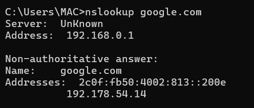

# Domain Name System (DNS)

## What is DNS?

DNS (Domain Name System) translates human-readable domain names into IP addresses.

Example:
google.com → 142.250.190.14

Without DNS, users would need to remember IP addresses instead of domain names.

---

## How DNS Works

1. User enters domain name
2. Request goes to local DNS resolver
3. If not cached, query moves up hierarchy:
   - Root server
   - TLD server
   - Authoritative server
4. IP address is returned

---

## DNS Record Types

A Record – Maps domain to IPv4 address  
AAAA Record – Maps domain to IPv6 address  
MX Record – Mail exchange server  
CNAME – Alias  
TXT – Verification and security records

---

## DNS Security Risks

- DNS spoofing
- DNS cache poisoning
- DNS tunneling (data exfiltration)
- Malicious domain communication

SOC analysts frequently monitor DNS logs to detect suspicious domains.

---

## Practical Demonstration

Command used:

nslookup google.com

