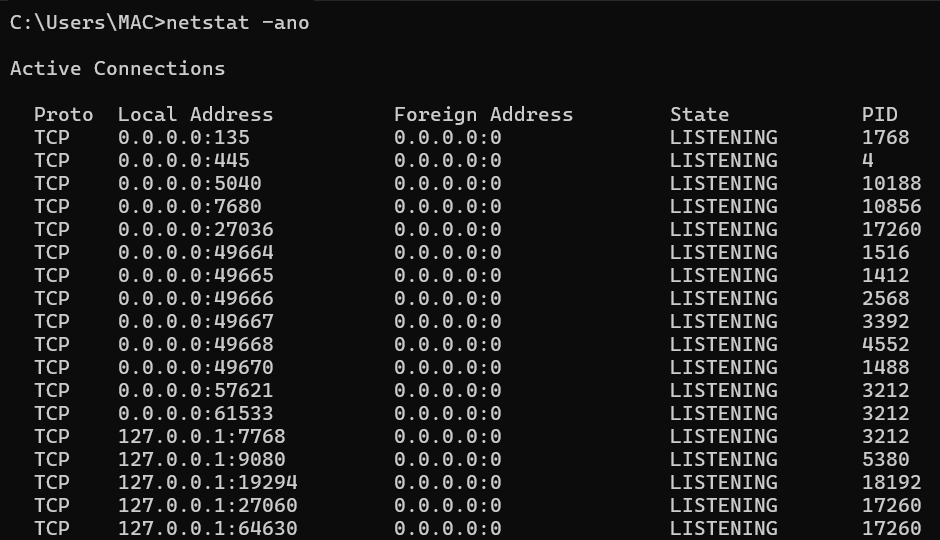

# FTP, SSH, and Telnet

## FTP (Port 21)

Used for file transfer.

Security risk:
Transmits credentials in plaintext.

Secure alternative:
SFTP (over SSH)

---

## SSH (Port 22)

Secure remote access protocol.

Encrypted communication.

Used for:
- Server administration
- Secure file transfer

---

## Telnet (Port 23)

Legacy remote access protocol.

Insecure – no encryption.

Should not be used in modern environments.

---

## Security Considerations

- Exposed SSH ports invite brute force attacks
- Telnet should be disabled
- Monitor authentication failures
