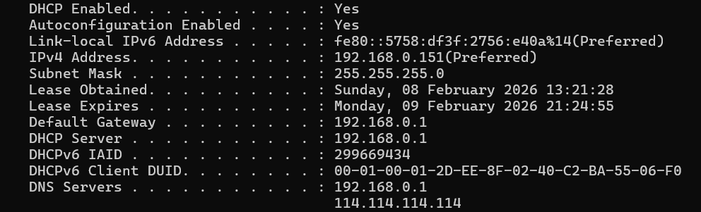
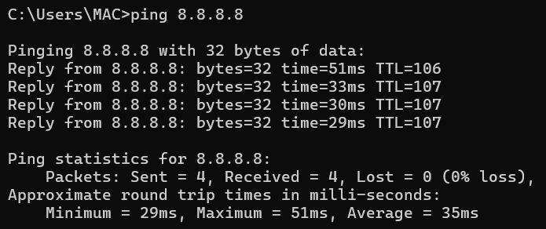
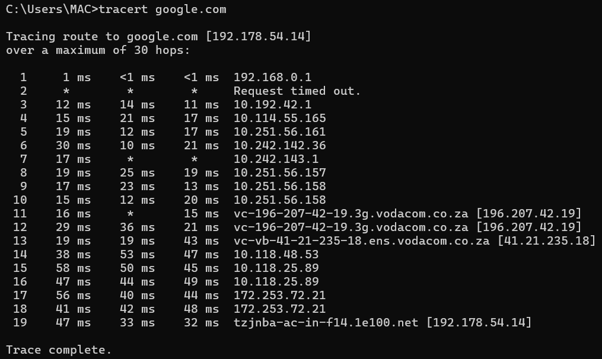

# Network Troubleshooting Command-Line Tools

## Purpose

Command-line tools provide direct visibility into network behavior and connectivity.

These tools are essential for troubleshooting and SOC investigations.

---

## ipconfig

Displays IP configuration information.

Usage:
ipconfig
ipconfig /all

Used to verify:
- IP address
- Subnet mask
- Default gateway
- DNS servers

---

## ping

Tests connectivity between hosts.

Usage:
ping 8.8.8.8

Used to:
- Verify network reachability
- Measure latency
- Detect packet loss

---

## tracert

Displays the path packets take to a destination.

Usage:
tracert google.com

Used to:
- Identify routing issues
- Detect network hops causing delays

---

## nslookup

Queries DNS servers.

Usage:
nslookup google.com

Used to:
- Verify DNS resolution
- Detect DNS-related issues

---

## netstat

Displays active connections and listening ports.

Usage:
netstat -ano

Used to:
- Identify open ports
- Detect suspicious connections

